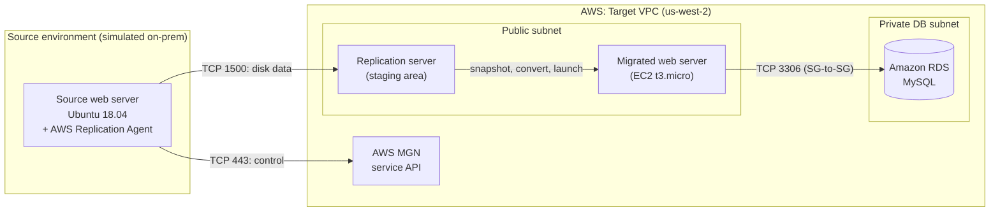
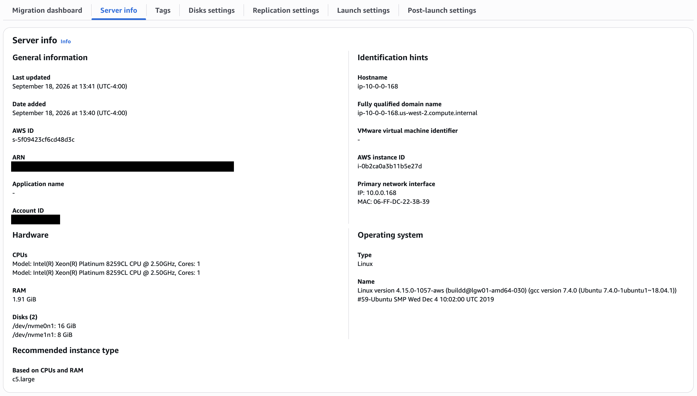
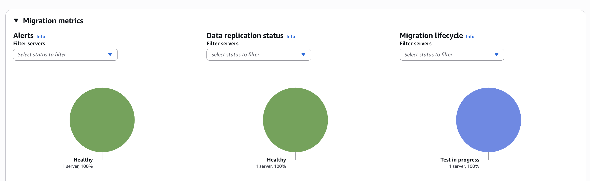
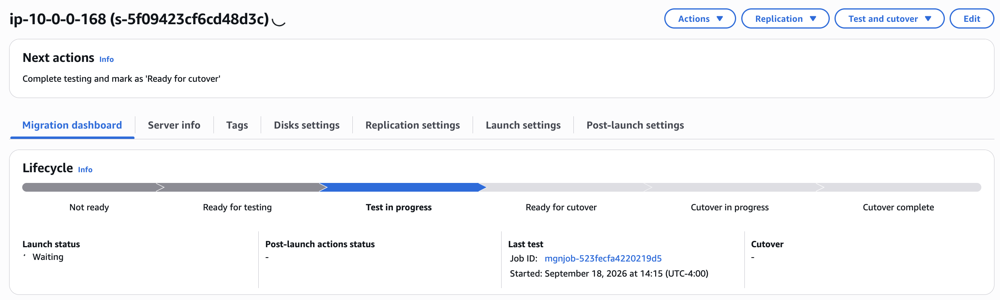
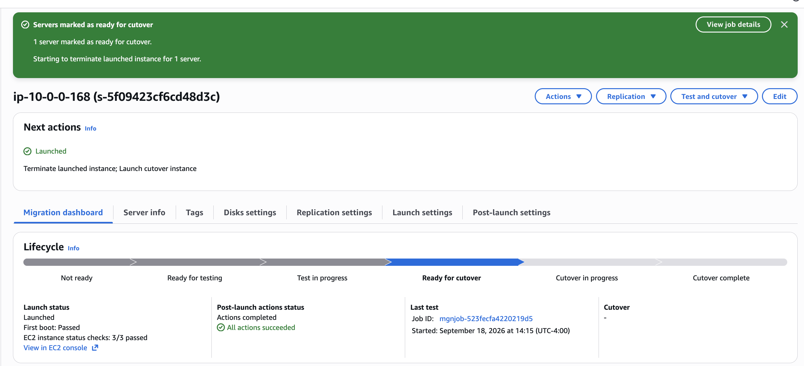
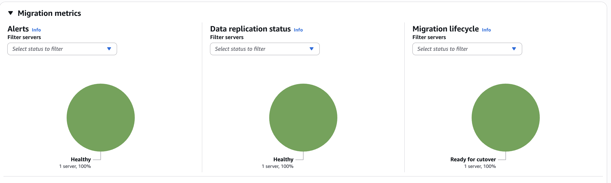
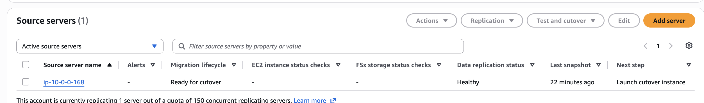
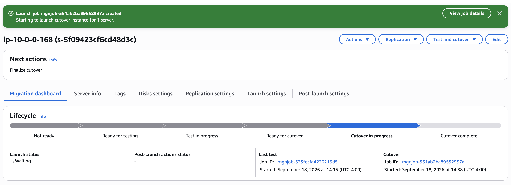
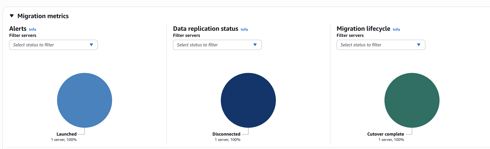

# Application Migration with AWS Application Migration Service (MGN)

**I migrated a running Linux web server into AWS using a lift-and-shift (rehost) strategy.** I replicated the server's disks continuously, validated a test copy, cut over with minimal downtime, and reconnected the application to its database on Amazon RDS.

`AWS MGN` `EC2` `EBS` `VPC & Security Groups` `IAM` `Systems Manager` `CloudWatch` `Amazon RDS` `Linux`

---

## At a glance

| | |
|---|---|
| **Goal** | Move a web server from a simulated on-premises environment into AWS with no changes to the source and minimal downtime |
| **Strategy** | Rehost (lift-and-shift) using AWS Application Migration Service |
| **Source** | Ubuntu 18.04 web server with 2 vCPU, 1.9 GiB RAM, and 2 disks (16 GiB + 8 GiB) |
| **Result** | Server live in AWS; lifecycle reached **Cutover complete**; post-launch monitoring installed automatically |
| **Test → cutover** | Test launched at 14:15, cutover launched at 14:38 (under 25 minutes from validation to production launch) |
| **Sizing decision** | Overrode MGN's spec-based `c5.large` recommendation with `t3.micro`, the suggested size for this environment |

## Skills demonstrated

- **Cloud migration:** agent-based block-level replication, test and cutover lifecycle, rollback-safe validation
- **Networking and security:** staging subnets, security-group-to-security-group rules, least exposure (Session Manager instead of SSH)
- **Cost awareness:** understanding why a tool's sizing recommendation can be wrong and when to override it
- **Automation:** EC2 launch templates, SSM post-launch actions, Parameter Store-driven CloudWatch agent config
- **Troubleshooting:** diagnosing and fixing a post-migration database connection failure

---

## Architecture



**How the data moves:** An agent on the source server reads every attached disk at block level and streams changes to a replication server in a staging subnet inside AWS. Data lands there first, not directly on the final server, and that keeps AWS within seconds of the source. When I launch a test or cutover, MGN snapshots that data, converts it to boot natively on EC2, and launches an instance. Each source disk becomes an EBS volume.

---

## What I did

### Phase 1: Assess the source server
Once the agent registered the server, MGN pulled its hardware and OS profile and **recommended a `c5.large`**, based on CPU and RAM alone:



MGN's right-sizing can't choose T-family instances, so for a small server it jumps to `c5.large`, the smallest type it supports. **I turned right-sizing off and set `t3.micro`, the suggested size for this environment.** See the production section below for how I'd approach sizing on a real workload.

I also found a dependency: the app relies on an external MySQL database, which meant it would need reconfiguring after migration.

### Phase 2: Mobilize, preparing the landing zone
- Initialized MGN and pointed replication at a dedicated **staging subnet**, so replication traffic stays separate from production.
- Installed the **AWS Replication Agent** over **Session Manager**, with no inbound SSH port needed, and replicated all disks.
- Built an **EC2 launch template** defining exactly how the migrated server comes up: instance type, subnet, a new `MigratedWebServer-SG` security group (HTTP only), public IP, tags, and IAM instance profile. I set this version as the default, because MGN always launches from the default.
- Added a **post-launch action** that installs the CloudWatch agent using a config I stored in **SSM Parameter Store**, so memory and swap monitoring exist from the first boot instead of being a manual to-do.

### Phase 3: Migrate, testing first and then cutting over
**Test launch.** I launched a test instance while the source kept running and replicating, so the test didn't disrupt anything:




The test instance passed **first boot and 3/3 EC2 status checks**, and **all post-launch actions succeeded**. I marked it ready for cutover, and MGN automatically terminated the test instance to avoid paying for it:





**Cutover.** I launched the production instance:



**Fixing the database connection.** A rehosted server is an exact copy, so the app was still pointed at the old database and failed to connect. I repointed the WordPress config to the RDS endpoint:

```bash
sudo sed -i "s|^.*DB_HOST.*$|define( 'DB_HOST', '<RDS_ENDPOINT>' );|" /var/www/html/wp-config.php
# same pattern for DB_USER and DB_PASSWORD
```

I then allowed MySQL (3306) into the database's security group **using the web server's security group as the source, not an IP address**, so the rule survives IP changes and scaling.

**Finalize.** I finalized the cutover. Replication shows **Disconnected** because the source is no longer needed, and the lifecycle is **Cutover complete**:



---

## Applying this in a production environment

**Size from real usage, not specs.** MGN recommends instance types from a server's *allocated* CPU and memory, so it can easily over-provision. For a production migration, I'd collect actual utilization data first:
- **MGN recommendation:** quick, but based on specs only; it ignores how busy the server really is.
- **AWS Application Discovery Service:** agents gather CPU, memory, and I/O usage over several weeks. It's more accurate, but it's no longer open to new customers.
- **AWS Transform:** the current approach. Agents collect weeks of utilization data, and its agentic chat recommends EC2 instance types from it.

**Keep downtime to the cutover window.** Continuous replication keeps AWS in sync while the source stays live, and test launches don't disrupt it. I'd always run at least one full test launch and keep the source intact until the cutover is verified, since MGN lets you revert at each stage.

**Map dependencies before cutover.** The database connection failure in this project is exactly what dependency mapping prevents. In production, I'd identify every database, API, and file share a server talks to during assessment, and plan the reconfiguration ahead of cutover day.

**Run it as a phased program.** Large migrations follow **Assess → Mobilize → Migrate & Modernize**: inventory and dependency mapping, then landing-zone preparation, then migration in waves. After rehosting, the next step would be modernizing, for example moving the app to managed or containerized services.

**Harden the setup:**

| In this project | In production |
|---|---|
| Permanent IAM access keys for the agent | Temporary credentials with **IAM Roles Anywhere** |
| HTTP open to `0.0.0.0/0` on the instance | Private instance behind an **Application Load Balancer** with HTTPS |
| Single instance | **Auto Scaling group** across multiple Availability Zones |
| Replication over the public internet | **Site-to-Site VPN or Direct Connect** with private-IP replication |
