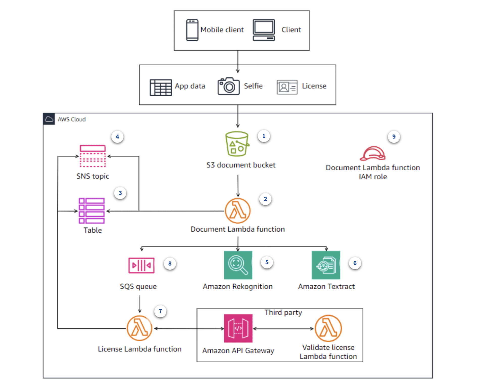
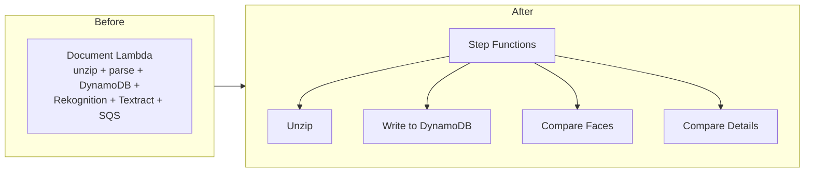
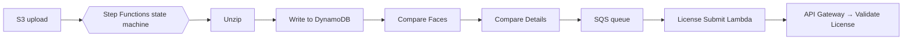

# Customer Onboarding App

A serverless customer onboarding application on AWS. A new customer submits their application details, a selfie, and a photo of their driver's license; the backend verifies their identity automatically, without a person reviewing the happy path. I designed and built the event-driven backend myself.

## Progress

| Phase | Description | Status |
|---|---|---|
| Document ingestion + identity verification | S3 upload → Document Lambda → DynamoDB / SNS, with Rekognition and Textract (built manually, then migrated to SAM) | In progress |
| License submission via SQS | SQS queue + License Submit Lambda that hands the license to the third-party validation API | Planned |
| Split into async functions | Break the Document Lambda into four single-purpose Lambda functions | Planned |
| Step Functions + X-Ray | Orchestrate the functions with a state machine and add distributed tracing | Planned |

## Overview

The app lets a customer submit application data, a selfie, and a driver's license photo through a client (web or mobile). The backend verifies the customer's identity by matching the selfie against the license photo and extracting/validating the license details, then records the outcome — all without a human in the loop for the happy path.

## Use Cases

- **Digital account opening (KYC):** verify a new customer's identity remotely before opening a bank or fintech account
- **Loan and insurance applications:** confirm an applicant is who they claim to be and capture their details in one submission
- **Any regulated onboarding:** the same document-and-selfie pipeline fits rentals, marketplaces, or gig platforms that need to verify identity before granting access

## Architecture



1. **Client / Mobile client** — customer submits app data, a selfie, and a license photo
2. **S3 document bucket** — uploads land here
3. **Document Lambda function** — triggered by the S3 upload; orchestrates verification
4. **DynamoDB Table** — stores document/application state
5. **SNS topic** — notified of table changes
6. **Amazon Rekognition** — compares the selfie to the license photo for identity match
7. **Amazon Textract** — extracts text/fields from the license image
8. **SQS queue** — Document Lambda hands off license verification work
9. **License Lambda function** — triggered by the SQS queue
10. **Amazon API Gateway → Validate license Lambda function (third party)** — License Lambda calls out to a third-party service to validate the license, then writes the result back to the Table
11. **Document Lambda function IAM role** — scopes the Document Lambda's permissions to only what it needs (S3, Rekognition, Textract, DynamoDB, SNS, SQS)

## What I Did

- Created the S3 document bucket, `customer-application-data-5911`, to receive customer app data, selfies, and license photo uploads
- Added a bucket policy denying access to the bucket and its objects over plain HTTP, requiring HTTPS (`aws:SecureTransport`)
- Created the Lambda execution role `customer-onboarding-lambda-role`, with a trust policy allowing `sts:AssumeRole` (for the Lambda service)
- Created the permissions policy `document_lambda_policy`, granting the Document Lambda `s3:GetObject` and `s3:PutObject` on the application bucket, `dynamodb:PutItem` and `dynamodb:UpdateItem` on the DynamoDB table, and `sns:Publish` on the SNS topic
- Added a bucket policy statement denying `s3:GetObject` to everyone except the Lambda role using `ArnNotEquals`
- Created the `CustomerMetadataTable` DynamoDB table with `APP_UUID` as the partition key, provisioned with 2 RCUs and 2 WCUs, with auto scaling configured to scale between 2 and 20 at 70% utilization
- Created the `ApplicationNotifications` SNS topic encrypted with the default `alias/aws/sns` KMS key, with an email subscription
- Wrote `DocumentLambda.py` — triggered by S3 `ObjectCreated:Put` on the `zipped/` prefix; downloads and extracts the zip to `/tmp`, uploads extracted files to the `unzipped/` prefix, parses the customer details CSV, and writes the record to DynamoDB

## Infrastructure as Code

Migrated the pipeline to AWS SAM (`template.yaml`): document ingestion, identity verification (Rekognition and Textract), and the mock third-party license-validation API. The SQS queue and License Submit Lambda are not built yet (see Next Steps below). Covers:

- **S3 bucket** (`CustomerApplicationBucket`) with HTTP deny bucket policy
- **DynamoDB table** (`CustomerMetadataTable`) with provisioned capacity and Application Auto Scaling for read and write capacity (target 70%, min 2, max 20)
- **SNS topic** (`ApplicationNotifications`) with KMS encryption and email subscription
- **IAM role** (`DocumentLambdaRole`) with inline policies for CloudWatch Logs, S3, DynamoDB, SNS, Rekognition (`CompareFaces`), and Textract (`AnalyzeID`) — no AWS managed policies
- **Lambda function** (`DocumentLambdaFunction`) using Python 3.13 runtime, 20s timeout, S3 event trigger on `zipped/` prefix, and `DYNAMODB_TABLE_NAME` and `TOPIC` environment variables. After saving the customer record, it compares the selfie to the license photo with Rekognition, extracts the license fields with Textract, checks them against the submitted details, records both results in DynamoDB, and publishes an SNS alert on any mismatch
- **Validate License Lambda + HTTP API** (`ValidateLicenseLambdaFunction`, `ValidateLicenseApi`) — a mock third-party license-validation service behind an API Gateway `POST /license` route, with its own least-privilege role
- **Lambda invoke permission** allowing S3 to invoke the Lambda (implicit, created by SAM from the `Events` declaration)

### Project Structure

```
customer_onboarding_app/
├── template.yaml               # SAM template
├── samconfig.toml              # SAM deployment config
├── document_lambda/
│   ├── DocumentLambdaSam.py    # Lambda function code
│   └── requirements.txt
├── validation_lambda/
│   └── ValidateLicenseLambdaFunction.py  # Mock license-validation function
└── images/
    └── architecture-diagram.png
```

### Deploy

```bash
sam build && sam deploy
```

## Next Steps (Planned)

The remaining work moves the app from one large Lambda function to a set of small, event-driven microservices, then adds orchestration and observability. Nothing in this section is built yet; it will be updated with details and screenshots as each part is completed.

### From one large function to microservices

**Before:** a single Document Lambda does everything: unzips the upload, parses the customer details, writes to DynamoDB, calls Rekognition and Textract, and hands off to SQS. It needs one broad IAM role, one timeout covers all the work, and a failure at any point affects the whole pipeline.

**After:** four single-purpose functions, each with its own narrowly scoped IAM role, timeout, and retry behavior, coordinated by a Step Functions state machine. X-Ray traces show where time is spent and where errors occur across the whole workflow.



**Trade-off:** more moving parts to deploy, permission, and monitor. That is why Step Functions (to keep the workflow in one place) and X-Ray (to see across the functions) are part of this design rather than an afterthought.

### License submission via SQS

- Create an SQS queue that holds licenses waiting for third-party validation, so license checks are decoupled from document processing (with a dead-letter queue for messages that repeatedly fail)
- Create the **License Submit Lambda** with the SQS queue as its event source and its own least-privilege execution role
- Write its code to read each queued message and call the third-party validation API (API Gateway → Validate License Lambda), then record the result in DynamoDB
- Update the Document Lambda to send the extracted license data to the queue instead of handling validation itself

### Refactor into async, single-purpose functions

Break the Document Lambda into four smaller functions that can run asynchronously:

| Function | Responsibility |
|---|---|
| **Unzip** | Download the uploaded zip from S3, extract it, and write the files to the `unzipped/` prefix |
| **Write to DynamoDB** | Parse the customer details and store the application record |
| **Compare Faces** | Use Rekognition to match the selfie against the license photo |
| **Compare Details** | Use Textract to extract the license fields and compare them to the application data |

Why: each function gets its own IAM role, timeout, retries, and scaling, and a failure is isolated to one step instead of the whole pipeline.

### Orchestrate with AWS Step Functions

- Build a **Step Functions state machine** that runs the four functions in order, passes each step's output to the next, and handles failures with retries and catch paths
- Replace the current Lambda-to-Lambda hand-offs with the state machine as the single place that defines the workflow
- Define the state machine in `template.yaml` (`AWS::Serverless::StateMachine`) so the workflow is deployed as code alongside everything else



The exact ordering (and whether any steps can run in parallel) will be finalized while building it.

### Observability with AWS X-Ray

- Enable X-Ray **active tracing** on the state machine to see each execution and how long every state takes
- Enable X-Ray tracing on the Lambda functions, and grant their execution roles permission to send trace data (custom roles do not get this automatically)
- Use the **service map** and individual traces to find slow steps and trace errors across Step Functions, Lambda, and downstream AWS services
- Keep using CloudWatch Logs alongside traces for function-level detail

### Infrastructure as Code follow-ups

- Extend `template.yaml` with the SQS queue and dead-letter queue, the new Lambda functions and roles, the state machine, and tracing settings
- Update the project structure below as new function folders are added
- Fill in the Screenshots, Files in This Directory, and Why This Project sections once the build is complete

## Screenshots

_TODO — planned screenshots to add:_

- [ ] SQS queue and License Submit Lambda configuration
- [ ] The four Lambda functions after the refactor
- [ ] Step Functions state machine graph and a successful execution
- [ ] X-Ray service map and an example trace

## Files in This Directory

_TODO_

## Tech / Services Used

- **Amazon S3** — document bucket for uploaded app data, selfies, and license photos
- **AWS Lambda** — Document Lambda function and License Lambda function
- **Amazon DynamoDB** — table storing onboarding/document state
- **Amazon SNS** — topic notified of table changes
- **Amazon SQS** — queue decoupling document processing from license verification
- **Amazon Rekognition** — selfie-to-license face verification
- **Amazon Textract** — text extraction from license images
- **Amazon API Gateway** — entry point to the third-party license validation service
- **AWS IAM** — least-privilege role for the Document Lambda function
- **AWS SAM** — infrastructure as code for the stack
- **AWS Step Functions** _(planned)_ — orchestrates the split-out Lambda functions as a single workflow
- **AWS X-Ray** _(planned)_ — distributed tracing across the state machine and Lambda functions
- **Amazon CloudWatch** — function logs, used alongside X-Ray traces

## Why This Project

_TODO_
