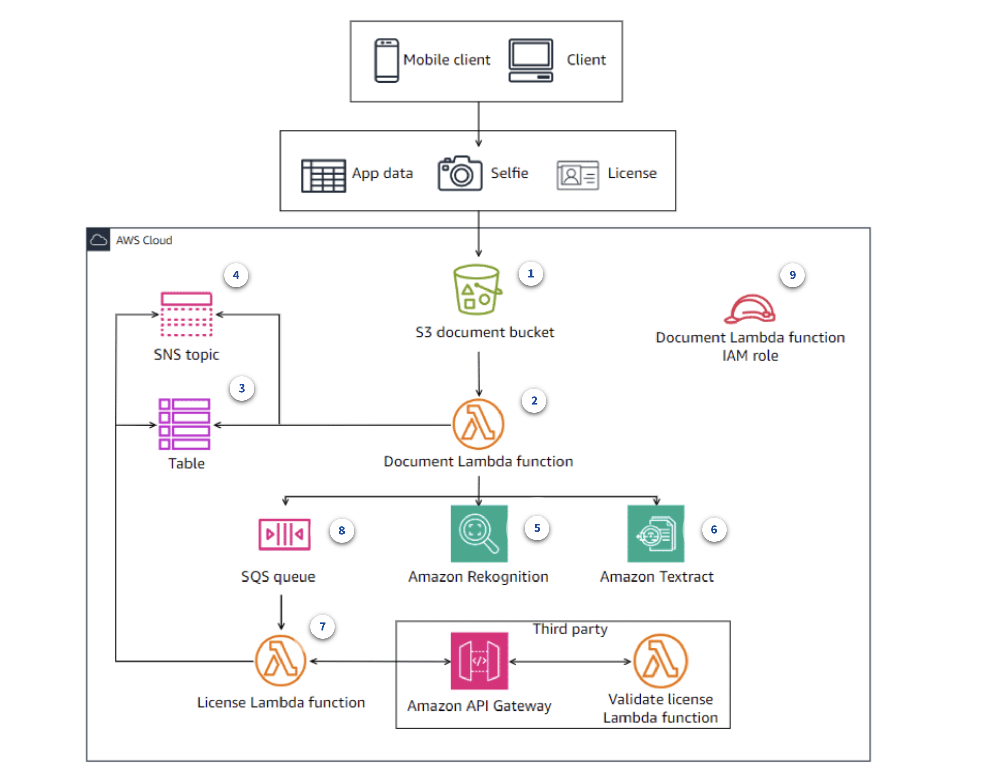
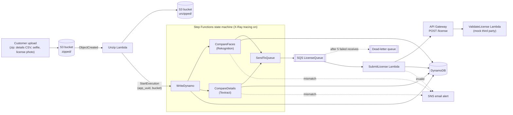

# Customer Onboarding App

A serverless customer onboarding application on AWS. A new customer submits their application details, a selfie, and a photo of their driver's license; the backend verifies their identity automatically, without a person reviewing the happy path. I designed and built the event-driven backend myself.

## Status

| Phase | Description | Status |
|---|---|---|
| Document ingestion + identity verification | S3 upload, unzip, DynamoDB record, Rekognition face match, Textract detail match | Done |
| License submission via SQS | SQS queue with dead-letter queue, plus a Lambda that calls the third-party validation API | Done |
| Split into single-purpose functions | The original single Lambda broken into small functions, each with its own role | Done |
| Step Functions + X-Ray | State machine orchestrating the validation steps, with X-Ray tracing | Done |

## Overview

The app lets a customer submit application data, a selfie, and a driver's license photo through a client (web or mobile). The backend verifies the customer's identity by matching the selfie against the license photo and checking the license details against what the customer typed in, then validates the license number with a third-party service and records every outcome in DynamoDB.

## Use Cases

- **Digital account opening (KYC):** verify a new customer's identity remotely before opening a bank or fintech account
- **Loan and insurance applications:** confirm an applicant is who they claim to be and capture their details in one submission
- **Any regulated onboarding:** the same document-and-selfie pipeline fits rentals, marketplaces, or gig platforms that need to verify identity before granting access

## Architecture



_The diagram above is the original single-function design. The current design splits that function up and orchestrates it with Step Functions, shown below._


```mermaid
flowchart LR
    C["Customer upload<br/>(zip: details CSV, selfie, license photo)"] --> S3[("S3 bucket<br/>zipped/")]
    S3 -->|ObjectCreated| U["Unzip Lambda"]
    U --> S3U[("S3 bucket<br/>unzipped/")]

    subgraph SM["Step Functions state machine (X-Ray tracing on)"]
        direction LR
        W["WriteDynamo"] --> F["CompareFaces<br/>(Rekognition)"]
        W --> D["CompareDetails<br/>(Textract)"]
        F --> Q["SendToQueue"]
        D --> Q
    end

    U -->|"StartExecution<br/>(app_uuid, bucket)"| W
    W --> DB[("DynamoDB")]
    F --> DB
    D --> DB
    F -. mismatch .-> SNS["SNS email alert"]
    D -. mismatch .-> SNS
    Q --> SQS[["SQS LicenseQueue"]]
    SQS -. "after 5 failed receives" .-> DLQ[["Dead-letter queue"]]
    SQS --> L["SubmitLicense Lambda"]
    L --> API["API Gateway<br/>POST /license"]
    API --> V["ValidateLicense Lambda<br/>(mock third party)"]
    L --> DB
    L -. invalid .-> SNS
```

### How a submission flows

| Step | Component | What it does |
|---|---|---|
| 1 | **Unzip Lambda** | Triggered by an S3 upload to `zipped/`. Extracts the zip, writes the files to `unzipped/`, then starts the state machine with the `app_uuid` and bucket name as input (named after the `app_uuid`, so each application gets one execution) |
| 2 | **WriteDynamo** | Reads the details CSV and writes the customer record to DynamoDB |
| 3a | **CompareFaces** | Rekognition compares the selfie to the license photo (80% similarity threshold) and saves `LICENSE_SELFIE_MATCH` |
| 3b | **CompareDetails** | Textract `AnalyzeID` reads the license, compares eight fields (name, date of birth, address parts, document number) against the CSV, and saves `LICENSE_DETAILS_MATCH` |
| 4 | **SendToQueue** | Runs only if both checks passed. Puts the license number on the SQS queue |
| 5 | **SubmitLicense Lambda** | Triggered by the queue (batch size 1). Calls the third-party validation API through API Gateway, saves `LICENSE_VALIDATION`, and sends an SNS alert if validation fails |

Steps 3a and 3b run in parallel inside a Step Functions `Parallel` state. The Unzip function's role is allowed to call `states:StartExecution` on this one state machine and nothing else.

**When something fails:** a face or detail mismatch writes `false` to the matching DynamoDB field, publishes an SNS email alert, and raises an error so the execution fails and nothing is sent for license validation. If the license call itself keeps failing, the SQS message is retried and moves to a dead-letter queue after 5 receives, so it is kept for inspection instead of being lost.

## Design Decisions

- **Single-purpose functions.** The original design was one Lambda that did everything. Splitting it gave each function its own narrowly scoped IAM role, timeout, and logs, and means a failure points at one step instead of the whole pipeline.
- **Step Functions for the validation workflow.** The order of steps, the parallel branch, and the "only continue if both checks pass" rule live in one state machine definition instead of being spread across function code.
- **SQS in front of the third-party call.** The license check is the one step that depends on a service outside my control. The queue keeps a slow or failing provider from blocking identity verification, absorbs bursts, and the dead-letter queue catches messages that keep failing.
- **Least privilege, no managed policies.** Every function and the state machine have their own inline-policy role, scoped to the resources they use.
- **Everything as code.** One SAM template defines the whole stack.

## Observability

- **AWS X-Ray:** active tracing is enabled on the state machine, and its role is allowed to send trace data, so each execution shows up with per-state timing and errors in the X-Ray console.
- **Amazon CloudWatch Logs:** every Lambda function has a role permitted to write to its own log group, used for function-level detail alongside the traces.

## Infrastructure as Code

The whole pipeline is defined in `template.yaml` (AWS SAM):

- **S3 bucket** (`CustomerApplicationBucket`) with a bucket policy that denies plain HTTP
- **DynamoDB table** (`CustomerMetadataTable`) with provisioned capacity and Application Auto Scaling for reads and writes (target 70%, min 2, max 20)
- **SNS topic** (`ApplicationNotifications`) with KMS encryption and an email subscription
- **Lambda functions** (Python 3.13): `UnzipLambda`, `WriteDynamoLambda`, `CompareFacesLambda`, `CompareDetailsLambda`, `SendToQueueLambda`, `SubmitLicenseLambda`, and `ValidateLicenseLambdaFunction`, each with its own IAM role
- **Step Functions state machine** (`CustomerOnboardingStateMachine`) with X-Ray tracing and its own role
- **SQS queue** (`LicenseQueue`, 300s visibility timeout) and **dead-letter queue** (`LicenseDeadLetterQueue`, redrive after 5 receives)
- **HTTP API** (`ValidateLicenseApi`) with a `POST /license` route to the mock third-party validation function
- **Triggers:** S3 `ObjectCreated` on `zipped/` triggers Unzip, Unzip starts the state machine, and the SQS queue triggers SubmitLicense

### Project Structure

```
customer_onboarding_app/
├── template.yaml                 # SAM template for the whole stack
├── samconfig.toml                # SAM deployment config
├── unzip_lambda/                 # Extracts the upload
├── write_dynamo_lambda/          # Writes the customer record
├── compare_faces_lambda/         # Rekognition selfie vs. license photo
├── compare_details_lambda/       # Textract license vs. submitted details
├── send_to_queue_lambda/         # Queues the license for third-party validation
├── submit_license_lambda/        # Calls the validation API, saves the result
├── validation_lambda/            # Mock third-party license validation
├── document_lambda/              # Original single-function version (no longer deployed)
└── images/
    └── architecture-diagram.png
```

### Deploy

```bash
sam build && sam deploy
```

## Initial Manual Build

Before moving to SAM, I built the first version by hand in the console:

- Created the S3 document bucket to receive customer app data, selfies, and license photo uploads
- Added a bucket policy denying access over plain HTTP, requiring HTTPS (`aws:SecureTransport`)
- Created the Lambda execution role with a trust policy allowing `sts:AssumeRole` for the Lambda service
- Created a permissions policy granting the Lambda `s3:GetObject` and `s3:PutObject` on the bucket, `dynamodb:PutItem` and `dynamodb:UpdateItem` on the table, and `sns:Publish` on the topic
- Added a bucket policy statement denying `s3:GetObject` to everyone except the Lambda role using `ArnNotEquals`
- Created the `CustomerMetadataTable` DynamoDB table with `APP_UUID` as the partition key and auto scaling between 2 and 20 at 70% utilization
- Created the `ApplicationNotifications` SNS topic, encrypted with the default `alias/aws/sns` KMS key, with an email subscription
- Wrote the first single-function version: triggered by S3 `ObjectCreated:Put` on `zipped/`, it extracted the zip, uploaded the files to `unzipped/`, parsed the details CSV, and wrote the record to DynamoDB

## Screenshots

_TODO_

## Tech / Services Used

- **Amazon S3** — document bucket for uploaded app data, selfies, and license photos
- **AWS Lambda** — one function per step of the pipeline
- **AWS Step Functions** — orchestrates the validation workflow, including the parallel face and detail checks
- **Amazon DynamoDB** — table storing each applicant's record and verification results
- **Amazon SNS** — email alerts when a check fails
- **Amazon SQS** — queue (with dead-letter queue) decoupling identity checks from third-party license validation
- **Amazon Rekognition** — selfie-to-license face comparison
- **Amazon Textract** — extracts fields from the license image
- **Amazon API Gateway** — HTTP API in front of the mock license validation service
- **AWS X-Ray** — tracing for state machine executions
- **Amazon CloudWatch** — Lambda function logs
- **AWS IAM** — separate least-privilege role per function and for the state machine
- **AWS SAM** — infrastructure as code for the whole stack

## Why This Project

_TODO_
