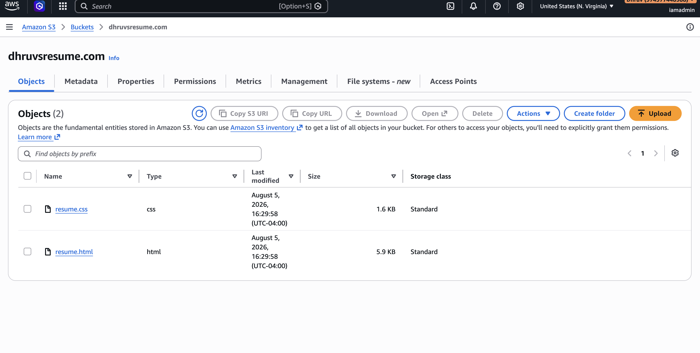
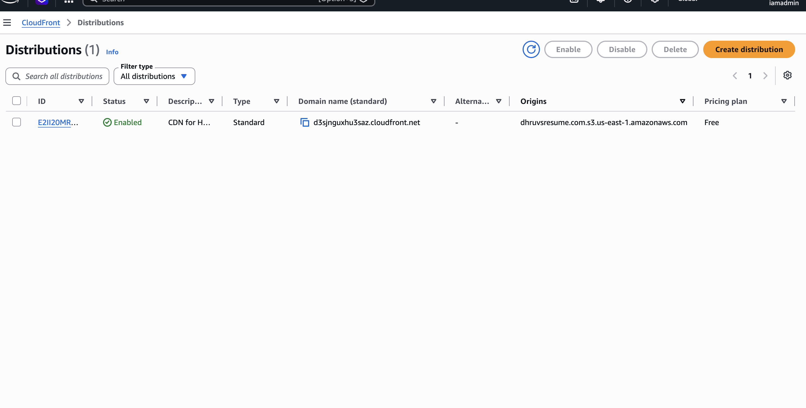

Readme · MD
# Resume Hosted on AWS S3 + CloudFront
 
A single-page HTML/CSS resume deployed as a static website on Amazon S3 and served securely over HTTPS through Amazon CloudFront.
 
**Live site:** [https://d3sjnguxhu3saz.cloudfront.net](https://d3sjnguxhu3saz.cloudfront.net)
 
## Overview
 
This project takes a static resume (`resume.html` + `resume.css`) and hosts it on AWS using S3's static website hosting feature. S3 static website endpoints only serve traffic over HTTP, so I put a CloudFront distribution in front of the bucket to provide HTTPS, giving the site a secure, publicly accessible URL with CDN-backed performance.
 
## Architecture
 
```
User Browser
     │
     │  HTTPS
     ▼
Amazon CloudFront (CDN + TLS termination)
     │
     │  HTTP (origin fetch)
     ▼
Amazon S3 Bucket (static website hosting)
     │
     └── resume.html, resume.css
```
 
## What I Did
 
1. **Created an S3 bucket** and enabled static website hosting, setting `resume.html` as the index document.
2. **Uploaded the site files** (`resume.html`, `resume.css`) to the bucket and configured bucket permissions/policy so the content could be read by CloudFront.
3. **Created a CloudFront distribution** with the S3 static website endpoint as the origin, so all traffic is served through CloudFront's edge network instead of hitting S3 directly.
4. **Enabled HTTPS on CloudFront**, since S3 website endpoints don't support TLS on their own. CloudFront terminates HTTPS at the edge and forwards requests to the S3 origin, giving visitors a secure `https://` connection to the resume.
5. **Verified the deployment** by loading the resume through the CloudFront domain and confirming it rendered correctly over HTTPS.
## Screenshots
 
**S3 bucket configured for static website hosting:**
 

 
**CloudFront distribution securing the site with HTTPS:**
 

 
## Tech / Services Used
 
- **Amazon S3** – static website hosting for the resume files
- **Amazon CloudFront** – CDN + HTTPS/TLS in front of the S3 origin
- **HTML/CSS** – the resume page itself
## Files in This Directory
 
| File | Description |
|---|---|
| `resume.html` | Resume content/markup |
| `resume.css` | Resume styling |
| `s3_bucket_for_resume.png` | Screenshot of the S3 bucket configuration |
| `cloudfront_distribution_https.png` | Screenshot of the CloudFront distribution |
 
## Why This Project
 
S3 alone is a fast, cheap way to host a static site, but it doesn't support HTTPS on its website endpoint — a real limitation for anything public-facing. This project demonstrates how to close that gap using CloudFront as a CDN/TLS layer in front of S3, a common pattern for serving static content securely and at low cost on AWS.
 


