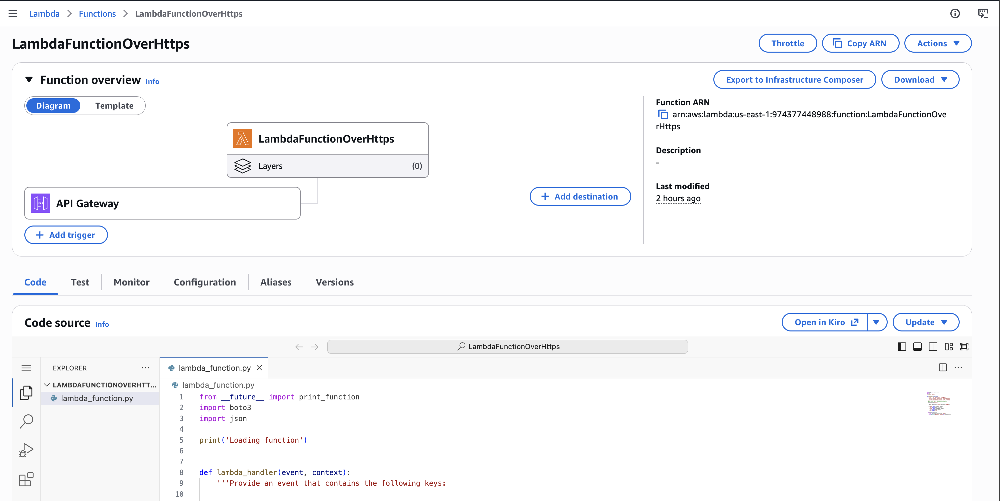
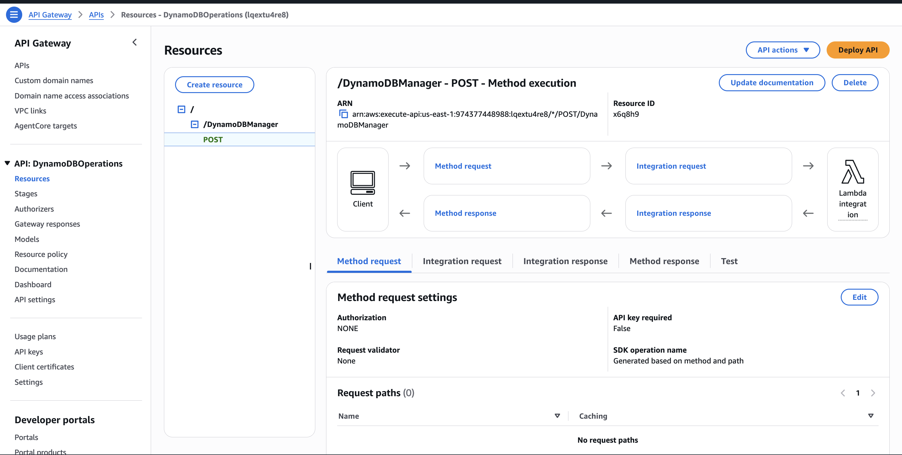
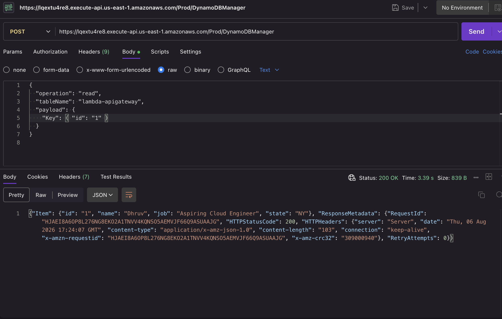
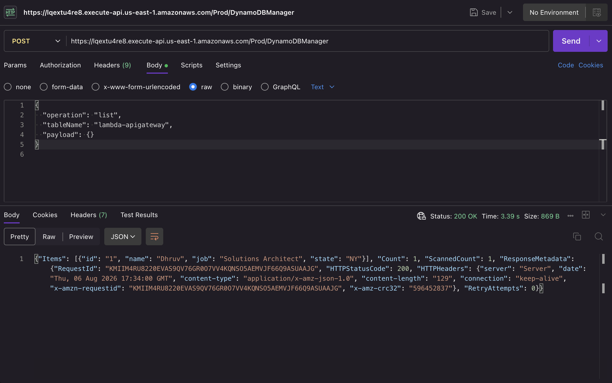
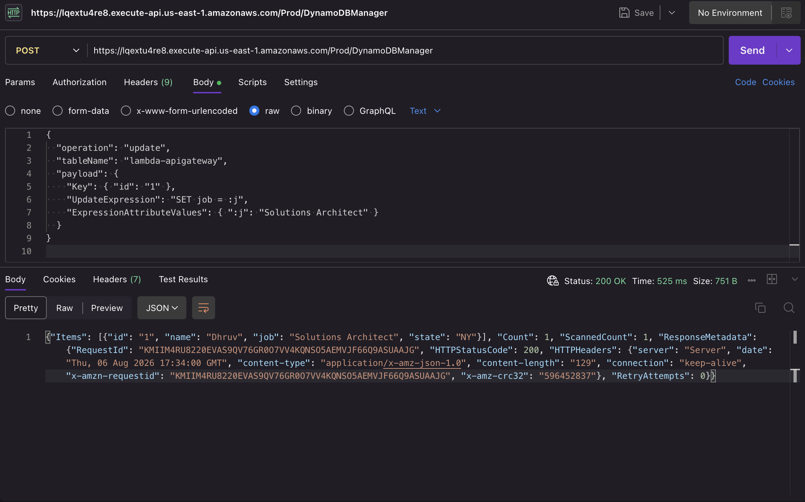
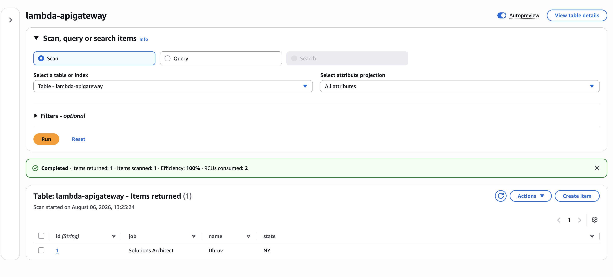
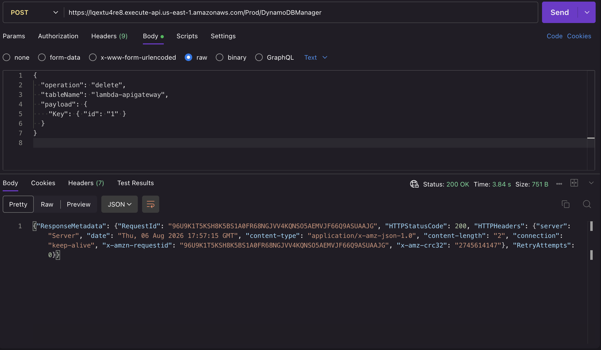
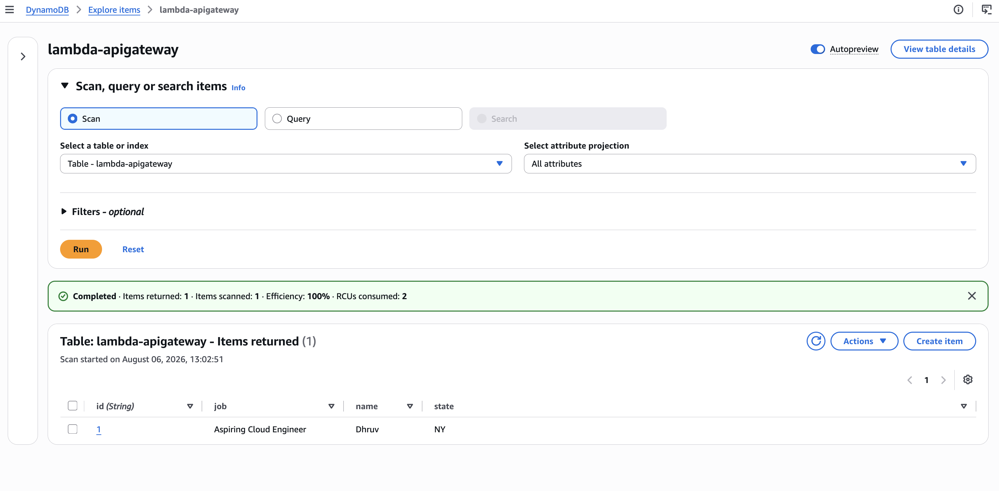

# Serverless CRUD API with API Gateway, Lambda + DynamoDB

A serverless REST API built with API Gateway, Lambda, and DynamoDB. A single Lambda function handles create, read, update, delete, and list operations against a DynamoDB table, and API Gateway exposes it over HTTPS as a POST endpoint that any client can call.

## Overview

The Lambda function (`lambda_function.py`) accepts an event with three fields: `operation`, `tableName`, and `payload`. Based on the operation, it routes the request to the matching DynamoDB action:

| Operation | DynamoDB action |
|---|---|
| `create` | `put_item` |
| `read` | `get_item` |
| `update` | `update_item` |
| `delete` | `delete_item` |
| `list` | `scan` |
| `echo` | returns the payload unchanged (for testing) |
| `ping` | returns `"pong"` (health check) |

API Gateway sits in front of the Lambda function as a `POST /DynamoDBManager` endpoint, so instead of invoking the function directly, users interact with it over HTTPS by sending a JSON body specifying the operation.

## Architecture

```
Client (Postman / any HTTP client)
              │
              │  HTTPS POST
              ▼
   Amazon API Gateway (/DynamoDBManager)
              │
              ▼
        AWS Lambda (LambdaFunctionOverHttps)
              │
              ▼
        Amazon DynamoDB (lambda-apigateway table)
```

## What I Did

1. **Created a DynamoDB table** (`lambda-apigateway`) to store items with fields like `id`, `name`, `state`, and `job`.
2. **Wrote a Lambda function** (`LambdaFunctionOverHttps`) in Python that maps an `operation` string to the corresponding `boto3` DynamoDB call, so one function handles all CRUD actions instead of writing a separate function per operation.
3. **Created an IAM policy** (`lambda_policy.json`) granting the Lambda execution role the minimum permissions needed: `PutItem`, `GetItem`, `UpdateItem`, `DeleteItem`, `Scan` on DynamoDB, plus CloudWatch Logs permissions for logging.
4. **Created an API Gateway REST API** with a `/DynamoDBManager` resource and a `POST` method integrated with the Lambda function, then deployed it to a `Prod` stage to get a public HTTPS endpoint.
5. **Tested the API using Postman**, sending POST requests with different `operation` values to the API Gateway endpoint and confirming DynamoDB was updated correctly by cross-checking the table in the AWS console.

## Infrastructure as Code

This project also includes a CloudFormation template, [`oneclicksetup.yaml`](./oneclicksetup.yaml), that automates the full setup above. It takes a table name and Lambda function name as input parameters and provisions the DynamoDB table, the Lambda execution role and function (with the handler code inlined in the template), and the API Gateway REST API, resource, method, and deployment, all in one stack. Once the stack finishes creating, the API endpoint is ready to call immediately and is printed as a stack output.

## Screenshots

**Lambda function overview, showing the API Gateway trigger wired to the function:**



**API Gateway resource configuration for the POST /DynamoDBManager method:**



**Read operation, tested in Postman against the API Gateway endpoint:**



**List operation, tested in Postman against the API Gateway endpoint:**



**Update operation, tested in Postman, with the DynamoDB item updated accordingly:**




**Delete operation, tested in Postman against the API Gateway endpoint:**



**Item created via the API, verified in the DynamoDB console:**



## Files in This Directory

| File | Description |
|---|---|
| `lambda_function.py` | Lambda handler that routes operations to DynamoDB actions |
| `lambda_policy.json` | IAM policy granting the Lambda role DynamoDB + CloudWatch Logs permissions |
| `test_json/` | Sample test events for each operation (create, read, update, delete, list, echo, ping) |
| `oneclicksetup.yaml` | CloudFormation template that provisions the DynamoDB table, Lambda function, IAM role, and API Gateway API |
| `screenshots/` | Console and Postman screenshots showing the API Gateway/Lambda setup and each operation running successfully |

## Tech / Services Used

- **Amazon API Gateway** – exposes the Lambda function as a public HTTPS REST endpoint
- **AWS Lambda** – runs the CRUD handler function
- **Amazon DynamoDB** – stores the data
- **IAM** – scoped permissions for the Lambda execution role
- **Python (boto3)** – Lambda runtime and AWS SDK
- **Postman** – used to test the deployed API endpoint

## Why This Project

This project demonstrates a common serverless API pattern on AWS: API Gateway handling the public-facing HTTPS interface, Lambda handling business logic, and DynamoDB as the data store, all without provisioning or managing any servers. It also shows end-to-end testing of a deployed API using Postman rather than just invoking the function directly from the Lambda console.
